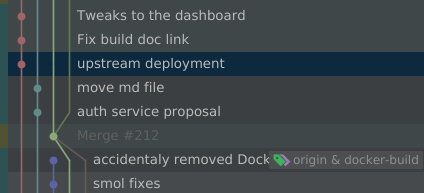

% Formation Git
% Jb Trystram
% 10-08-2021


# Collaborer avec Git

Avec du rust en bonus !




# Introduction

Git : "Magie noire pour voyager dans le temps en ajoutant ou soustrayant des fichiers textes a d'autres fichiers textes"
  
  - Conserver tout l'historique d'évolution d'une base de code.
  - Travailler sur un ou plusieurs changements en parrallèle sans casser le projet.
  - Synchroniser tout ça a plusieurs

=> Objectif : travailler a plusieurs sur la meme base de code, simplement et sans risques


---
# level : Git sorcerer skills
A priori rien de nouveau ?

- Cloner : `git clone`
- Commiter des fichiers après modifications : `git add && git commit`
- Pousser des commits vers un repo distant : `git push`
- Télécharger les commits du repo distant : `git pull`

--- 

# level up : git mage

## le coeur de git
 - chaines de commits et pointeurs 
 - les 3 états des fichiers
  
---

### Commits et pointeurs
 
Commit = reférence commit parent + changements (patch) + metadata

```
commit bbd550e501503a9d580b33b2d867ee3eee133ae8 (origin/main, origin/HEAD)
parent a72c052f5766f82b31f2caaea6a78460714c830c
Author: jbtrystram <jbtrystram@redhat.com>
Date:   Mon Aug 16 16:38:02 2021 +0200

    update changelog

diff --git a/CHANGELOG.md b/CHANGELOG.md
index 3cb9172..63ddc4f 100644
--- a/CHANGELOG.md
+++ b/CHANGELOG.md
@@ -6,6 +6,7 @@
  - Added a `set` operation to easily add credentials or a gateway to a device.
  - Devices and apps can now be listed if not ID is specified :  `drg get apps` will list existing apps.
  Plural and singular forms of a resource can be used interchangeably.
+ - Endpoints information in whoami -e. It's also possible to specify a service name to get only the url.

```

branche = pointeur vers un commit qui suit chaque nouveau commit

---

### États des fichiers

- commited : changements enregistrés dans un commit
- staged : changements enregistrés pas encore commités : `git diff --staged`
- modified: changements pas encore sélectionnés pour un commit : `git diff`

```
  Commited  ---(do work)--> modified ---(git add)---> staged
      ^--------------(git commit)-----------------------|
```

#### Astuces
+ Staging partiel : `git add -p`
+ Modifier un commit a postériori : `git commit --amend`

---

## Manier git 
  
  - branches: univers parallèles 
  - rebase: voyager dans le temps
  - tags: faire des releases fiables
  
### Branches

Copie cachée du repo

```shell
               X---Y---Z  feature
             / 
    A---B---C---D---E---F  main
```

- créer une branche : `git checkout -b turbo` alias `git branch turbo && git checkout turbo`.
La branche se fait toujours a partir d'un commit.
L'étiquette se met à jour avec chaque nouveau commit. 
---

```shell
               W---X---Y---Z
             /              \
    A---B---C---D---E---F---WXYZ main, feature
```
Merger une branche : `git merge feature main`.

=>  A vous d'essayer!

::: notes
Faites une branche et ajoutez votre nom au hello world! 
Puis merge!
:::

---
```shell
                          X nom
                         / 
    A---B---C---D---E---F  main
```
Fast-forward merge: 
```shell
    A---B---C---D---E---F---X  main, nom
```

---

Détail : la branche se met a jour en fonction de votre checkout:
```shell
               W---X---Y---Z   O---P feature
             /              \ /
    A---B---C---D---E---F---WXYZ main
```

---

### Rebase

- Rejouer l'historique d'une branche à partir d'un autre commit : 

```shell
               X---Y---Z  feature
             / 
    A---B---C---D---E---F  main
```
`git rebase main feature` :
```shell
                           X---Y---Z  feature
                         / 
    A---B---C---D---E---F  main
```

::: notes
On peut rebase sur un commit directement.
Vu que une branche n'est jamais qu'un pointeur vers un commit.
:::
---

- Refaire l'histoire avec rebase
```shell
               X---Y---Z  feature
             / 
    A---B---C---D---E---F  main

   git rebase -i <parent_du_dernier_commit_a_modifier>
   git rebase -i C # ou HEAD~3

```shell
               X  feature
             / 
    A---B---C---D---E---F  main
```
- réordonner les commits
- Supprimer des commits
- changer le message de commit
- altérer le commit (ajouter des choses ou le diviser)
- fusionner des commits (squash ou fixup)

Astuce : `HEAD~3`

=> Attention à la mise a jour forcée!
=> Experimentez sur la branche `deLorean`
::: notes
Préferer `git revert` si la branche est déjà poussée.
git commit --amend peut être vu comme un rebase -i de HEAD^
:::


### Tag

Un tag est une simple étiquette vers un commit:
git tag -a v2.1 -m "release sept 21" <commitRef>`

```
git show v2.1

tag v2.1
Tagger: jbtrystram <jbtrystram@redhat.com>
Date:   Thu Sep 2 16:30:17 2021 +0200

release sept 21

commit aa2692440781883f49cb2127fd2b0272fe7f7a38 (HEAD -> main, tag: v2.1)
Merge: 47351eb 66c8c5a
Author: jbtrystram <jbtrystram@redhat.com>
Date:   Thu Sep 2 16:14:02 2021 +0200

    Merge branch 'feature/command'
```

# Level up : git wizzard

## Astuces staging area
`add && commit` -> `git commit -a` (ou `-p` pour faire du selectif) \
 => explorez les options !

bisect : trouver un commit problématique
`git bisect <dernier_bon_commit>`
 
=> essayez sur la branche `bisect`

---

## stash : Rapidement changer de contexte.

- `git stash push` : changements stagés et non stagés mis de côté. \
Astuce : ajoutez un message : `git stash push -m "fixing array oob #334"`
- `git stash pop` : retirer et réappliquer la dernière entrée de la stash.
- `git stash apply` : la même mais sans supprimer l'entrée dans la stash.
- `git stash branch <branch_name>` : créer une branche avec le contenu de la dernière entrée. 
 
:::notes
 Possible d'avoir plusieurs entrées et de choisir.
:::

---

 ## Mais où suis-je ?
 
 - `git log` (`--graph --all`)
 - `git status`
 - `git show` : montrer les détails d'un commit
 
--- 

## Astuces pour manipuler l'historique 


### reflog

"Oh la boulette !"
Reflog référence tous les changements du pointeur HEAD.

Exemple :
```shell
    A---B---C---D main

 # drop du commit D:
git rebase -i HEAD~2
    A---B---C  main
```

`git reflog`
```shell
## REBASE drop de D:
0b3a33c (HEAD -> main) HEAD@{0}: rebase (finish): returning to refs/heads/main
0b3a33c (HEAD -> main) HEAD@{1}: rebase (start): checkout HEAD~2
899c5a9 HEAD@{2}: commit: D
0b3a33c (HEAD -> main) HEAD@{3}: commit: C
111723a HEAD@{4}: commit: B
2233e43 HEAD@{5}: commit (initial): A
```

`git reset 899c5a9`: les changements entre 899c5a9 et le résultat du rebase sont restaurés dans le répertoire de travail (unstaged).
Pour restaurer le repo a l'état voulu : `git reset --hard 899c5a9` -> le commit D est restauré.

Rien n'est jamais perdu avec git (même si rebase avec des commits droppés).

---

 - cherry pick (range of commits)
 - submodules
 - hooks
 - conventionnal commits


## Github: 
- pull requests
- issues 
- (Private vs Pub repo)

## Resources

- https://git-scm.com/docs (beaucoup de pages sont traduites en français)
- https://www.atlassian.com/fr/git
